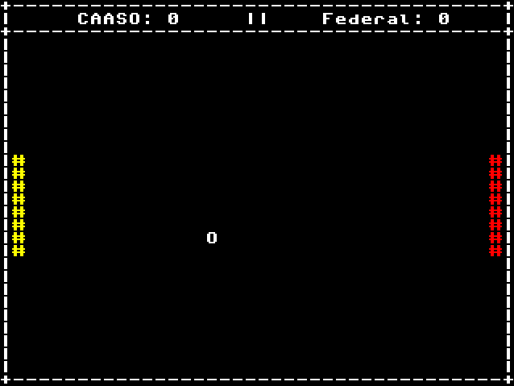

# Pong
## Trabalho de SSC0119-Pratica-em-Organizacao-de-Computadores
O trabalho consistiu na implementação de um jogo no assembly do ICMC e
na implementação do processador, com a adição de uma funcionalidade nova.

Neste projeto, foi implementado um clone de Pong, e com a adição de uma
funcionalidade de geração de número aleatórios.



## Membros:
</td>
        </tr>
    </tbody>
</table>

| NUSP     | Nomes                      |
| :--------| ---------------------------|
| 14577862 | Hélio Márcio Cabral Santos |  
| 14572099 |  Gabriel Martins Monteiro  |
| 11819487 |    Andrey Cortez Rufino    |

## Modificação do Processador

Foi adicionado uma função de linear-feedback shift register. Essa função
era utilizada por jogos e programas antigos para gerar números pseudo-
aleatórios. 

A funcionalidade dela pode ser resumida da forma:
```
bit_menos_significativo = x & 1
x = x >> 1
if bit_menos_significativo == '1' then
    x = x xor magic_number
```

Para ser usada em assembly, basta escrever da seguinte forma:

```
    rnd rx ry
```

Dessa forma, o ry sofrerá a operação e seu valor será salvo no rx.

## Rodando o jogo no processador

Baixe e extraia o processador do ICMC pelo [link](https://github.com/simoesusp/Processador-ICMC/tree/master/Processor_FPGA).
Substitua a cpu.vhd desse diretório da cpu.
Renomeie o jogo para cpuram.mif e copie para o diretório da cpu.
Compile e rode na FPGA!

## Compilador Online
https://proc.giroto.dev/
